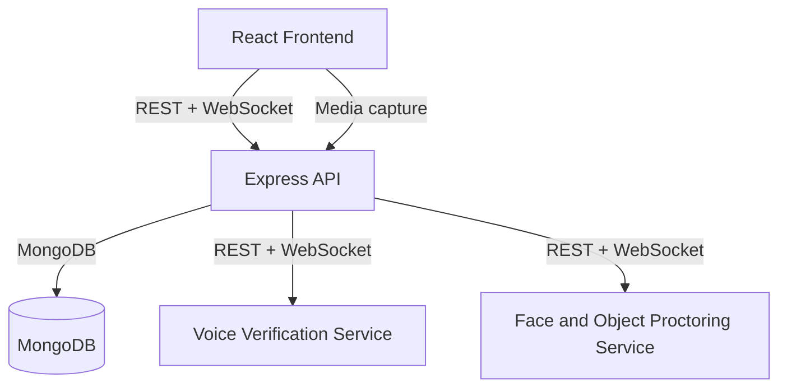

# IntelliHire

IntelliHire is an AI-powered recruitment and interview automation system that unifies job posting, application screening, adaptive interviews, and multi-modal integrity checks in a single workflow. The system consists of a React frontend, an Express and MongoDB backend, and two Python microservices for voice and face proctoring.

## Problem it solves
- Hiring pipelines are fragmented across separate tools, which creates duplicated data and no end-to-end evidence trail.
- AI screening can be unreliable or biased when model output is treated as a final decision instead of advisory input.
- Remote interviews are vulnerable to impersonation and off-screen assistance without strong identity and integrity checks.

IntelliHire consolidates these stages into one system where AI outputs are evidence for humans to review, not final decisions.

## Core capabilities
Candidate experience
- Profile management (education, experience, skills, resume, intro video)
- Job discovery, application submission, and status tracking
- Adaptive AI interviews with real-time proctoring
- Interview reports and re-interview requests
- Real-time notifications

Employer experience
- Job creation, publishing, updates, and closure
- Application review with AI resume ranking and interview reports
- Interview scheduling and candidate status management
- Dashboard metrics and company branding

AI and integrity modules
- Resume ranking: multi-agent LLM council
- Interview engine: adaptive questions, answer evaluation, and speech-to-text transcription
- Proctoring: voice verification, face verification, liveness detection, and object detection
- Browser integrity monitoring via focus and visibility events

## Architecture overview

## Workflow (from thesis)
1. Employer creates a job posting.
2. Candidate submits an application with resume and intro video.
3. The system parses and scores resumes (AI advisory results).
4. Shortlisted candidates receive interview invitations.
5. The AI interview runs with live proctoring enabled.
6. Responses, transcripts, and integrity logs are stored with the session.
7. Employer reviews evidence and makes the final decision.

## Major modules
Resume ranking
- LLM council : job description extractor, resume analyzer, semantic matcher, supervisor verdict.
- Results stored in ResumeAnalysis and linked to the application.

Interview engine
- Groq Llama 3.3 70B for question generation and answer evaluation.
- Groq Whisper for speech-to-text transcription.
- Adaptive questioning with controlled topic coverage and depth.
- Re-ask handling for silence and low-confidence responses.

Voice proctoring
- FastAPI service using pyannote.audio (ResNet34 embeddings) with Silero VAD.
- Streams 16 kHz mono float32 PCM via WebSocket.
- Mismatch audio clips stored in uploads/voice-mismatches.

Face and object proctoring
- FastAPI service with InsightFace ArcFace (buffalo_l) for identity verification.
- Liveness detection via MiniFASNetV2 and MediaPipe landmarks.
- YOLO object detection for prohibited items and multi-person checks.

## Tech stack (code-defined)
Frontend
- React 19, Vite 7, Tailwind CSS 4
- Redux Toolkit, React Router, React Hook Form, Zod
- Clerk authentication, Axios API client

Backend
- Node.js, Express 5, Mongoose 8, MongoDB
- Clerk auth and webhooks (Svix)
- Groq LLM and Whisper APIs
- WebSocket server (ws)
- File handling with Multer and FFmpeg

Voice service
- FastAPI, Uvicorn
- pyannote.audio, torch, torchaudio
- Silero VAD, numpy, scipy

Face service
- FastAPI, Uvicorn
- InsightFace, OpenCV, MediaPipe
- ONNX Runtime (anti-spoofing)

## Data model overview
- User, CandidateProfile, EmployerProfile
- Job, JobApplication
- InterviewSession
- ResumeAnalysis
- Notification

## Configuration (from code)
Frontend
- VITE_API_BASE_URL
- VITE_CLERK_PUBLISHABLE_KEY

Backend
- PORT, NODE_ENV, MONGODB_URI, CORS_ORIGIN, APP_URL
- CLERK_SECRET_KEY, CLERK_PUBLISHABLE_KEY, CLERK_WEBHOOK_SECRET
- GROQ_API_KEY, GROQ_MODEL, INTERVIEW_MAX_REASK_ATTEMPTS
- VOICE_SERVICE_URL, FACE_SERVICE_URL
- AI_API_PROVIDER, OPENROUTER_API_KEY, OPENROUTER_MODEL
- HUGGINGFACE_API_KEY, OPENAI_API_KEY, LOCAL_LLM_URL
- USE_HYBRID_RANKING, FORCE_DETERMINISTIC_SCORING
- EMAIL_ENABLED, SMTP_HOST, SMTP_PORT, SMTP_SECURE, SMTP_USER, SMTP_PASS, EMAIL_FROM
- CLERK_USER_CACHE_TTL_MS, AUTH_DEBUG_CACHE
- ENROLLMENT_RECOVERY_COOLDOWN_MS, INTERVIEW_START_GRACE_MS

Voice service
- Service defaults are defined in voice_verification_only/config.py (port 8000).

Face service
- OBJECT_MODEL_PATH (optional override for YOLO model path).

## Local entry points
- Backend: npm run dev (or npm start) in backend
- Frontend: npm run dev in frontend
- Voice service: python server.py in voice_verification_only
- Face service: uvicorn app.main:app --host 0.0.0.0 --port 8001 in Face proctoring

## Closing note
IntelliHire is designed as a unified, evidence-driven recruitment workflow: AI augments screening and interviewing, while final hiring decisions remain human. The architecture is modular, the proctoring signals are auditable, and the platform is built to scale from a prototype into a production-grade system.

